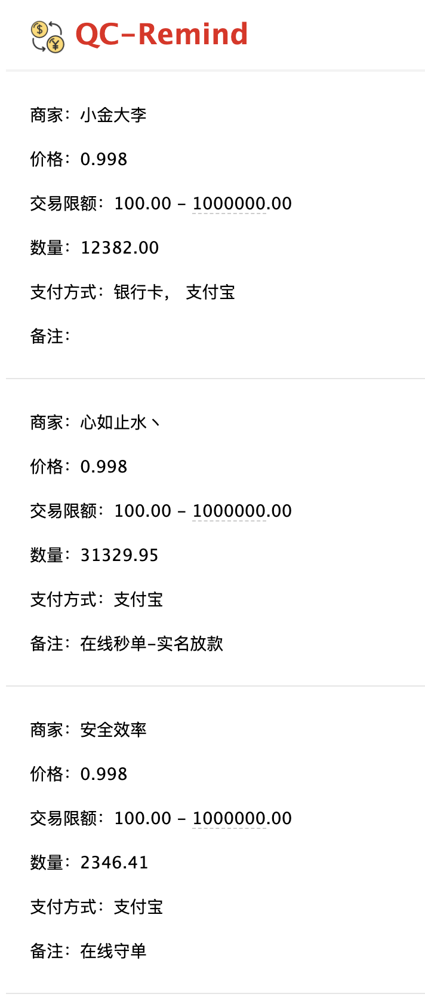

## QC-Remind


因为我经常需要买卖 QC，为了避免错过最佳的交易时机，所以写了该项目，用来提醒我 QC 市场价，争取获得最大收益。

该项目通过获取 ZB 网站 OTC 卖单来获取 QC 价格，根据用户的配置进行提醒。

### 使用

```bash
$ git clone git@github.com:AD-feiben/qc-remind.git

$ cd qc-remind

# 创建虚拟环境
$ ./create_venv.sh

# 激活虚拟环境
$ source venv/bin/activate

# 安装依赖
$ pip install -r requirements.txt
```

### 添加配置

```python
# config.py
import os


URL = 'https://vip.zb.plus/api/web/otc/V1_0_0/getOnlineAdList'

Env_mail_host = os.environ['mail_host']
Env_mail_user = os.environ['mail_user']
Env_mail_pass = os.environ['mail_pass']

Mail_host = Env_mail_host if Env_mail_host is not None else 'email smtp'
# 使用该邮件发送
Mail_user = Env_mail_user if Env_mail_user is not None else 'your email'
Mail_pass = Env_mail_pass if Env_mail_pass is not None else 'your authorization code'

# 接口请求异常将会发送邮件通知
Owner_email = Mail_user

# 用户配置
Persons = [
    {
        'email': 'your email',
        # 小于等于该价格，发送提醒
        'lower': 0.992,
        # 大于等于该价格，发送提醒
        'higher': 1,
        # 发送邮件后 N 分钟内不再发送邮件
        'recheck': 5,
        # 收款方式
        'payways': ['银行卡', '微信', '支付宝']
    }
]

# 定时任务运行时间
Scheduler = {
    'hour': '8-23',
    'minute': '*/1'
}

```

### 运行 & 停止

```bash
# 运行
$ ./bootstrap.sh start

# 停止
$ ./bootstrap.sh stop
```

### Docker

```bash
$ docker run -dit --rm -v ~/your_path/config.py:/app/config.py feiben/qc-remind
```

查看日志

```bash
$ docker ps
CONTAINER ID        IMAGE               COMMAND             CREATED              STATUS              PORTS               NAMES
7c51baf5d954        feiben/qc-remind    "python main.py"    About a minute ago   Up About a minute                       silly_lewin

$ docker exec -it 7c51baf5d954 /bin/bash 
root@7c51baf5d954:/app# ls
Dockerfile  __pycache__  bootstrap.sh  config.py  main.py  qc-remind.log requirements.txt  template  utils
root@7c51baf5d954:/app# tail -f qc-remind.log
```

### 运行效果

